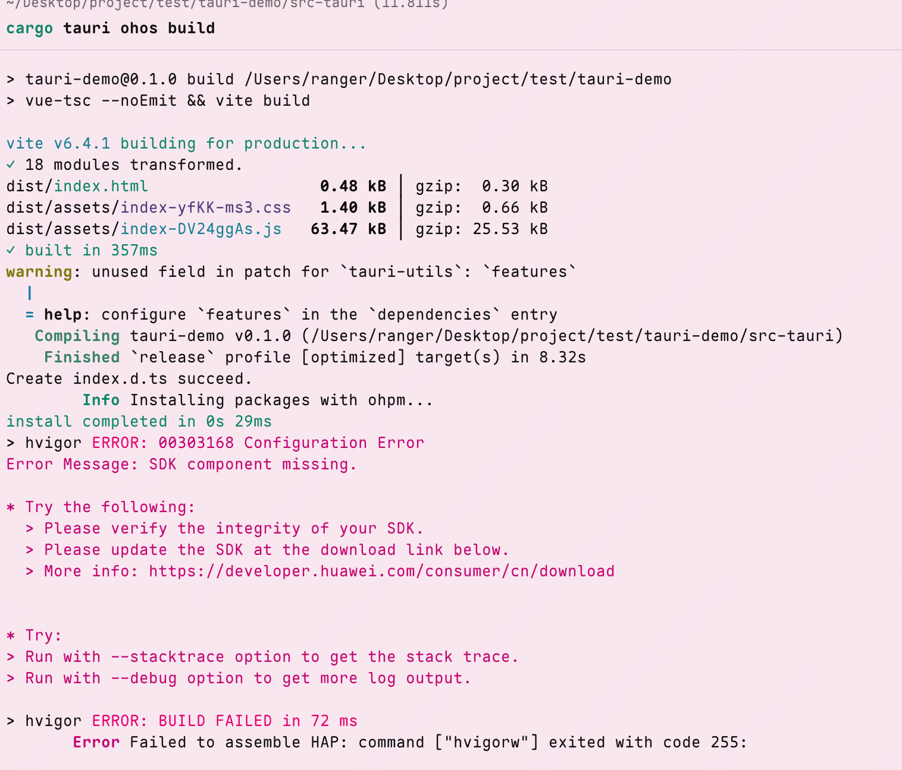

# Tauri prototype for OpenHarmony/HarmonyNext


## Setup

1. Install tauri-cli and ohrs from git.
```bash
cargo install tauri-cli --git https://github.com/tauri-apps/tauri --branch feat/open-harmony

cargo install ohrs
```

2. Clone the repo

```
git clone https://github.com/richerfu/tauri-demo.git
```

3. Install the dependencies.

```bash
pnpm install

cd src-tauri && cargo fetch
```

## Build and run

Build with tauri-cli.

```bash
cd src-tauri && cargo tauri ohos --build
```

If you get the following error, ignore it.



Open the `src-tauri/gen/ohos` within DevEcoStudio and run it.


 ## Note

 1. `libentry.so` is a template library and you can ignore it.
 2. `RustAbility` will forward lifecycle automatically.